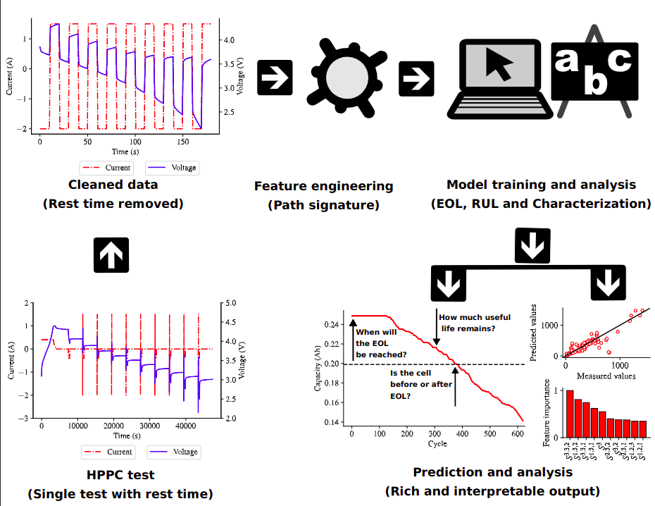

# pulse-project
This repository contains the codes for all the model training and experiments performed in the project [_Path signature-based life prognostics of Li-ion battery using pulse test data_](https://www.sciencedirect.com/science/article/pii/S0306261924022037).

Common models predicting the End of Life (EOL) and Remaining Useful Life (RUL) of Li-ion cells make use of long cycling data samples. This is a bottleneck when predictions are needed for decision-making but no historical data is available. A machine learning model to predict the EOL and RUL of Li-ion cells using only data contained in a single Hybrid Pulse Power Characterization (HPPC) test is proposed. The model ignores the cell’s prior cycling usage and is validated across nine different datasets each with its cathode chemistry. A model able to classify cells on whether they have passed EOL given an HPPC test is also developed.

The graphical abstract illustrating the modelling techniques is given below:



## Set up
1. Clone the repository by running
    ```
    git clone https://github.com/Rasheed19/pulse-project.git
    ```
1. Navigate to the root folder, create a python virtual environment by running
    ```
    python -m venv .venv
    ```
    Note that Python 3.10 was used in this research but Python >= 3.10 should work.

1. Activate the virtual environment by running
    ```
    source .venv/bin/activate
    ```
1. Prepare all modules and required directories by running the following:
    ```
    make setup
    make create-required-dir
    ```
1. Download the refined data from https://acdc.alcf.anl.gov/mdf/detail/camp_2023_v3.5/ and put them in `noah_raw_data`.

## Usage

After setting up the project environment as instructed above, the following pipelines can be run from the terminal:
1. `training` pipeline provides a medium to train the three proposed models, namely, `eol`, `rul`, and `classification`. This pipeline is facilited by the `run_train.py` entrypoint. To train the `eol` model given that the downloaded data has not been loaded into a Pyhthon dictionary:
    ```
    python run_train.py --not-loaded --model-type eol
    ```
1. `experiment` pipeline gives access to run the experiment that deals with the effect of varying pulse cycles on model performance. It requires two arguments `--threshold-type` and `--model-type`. The latter states the type of pulse threshold to use (either `point` or `interval`) and the former gives the model type (`eol`, `rul`, or `classification`). For instance:
    ```
    python run_experiment.py --threshold-type point --model-type eol
    ```
1. `leave-one-group-out` cross-validation pipeline is facilated by the `run_val.py` entrypoint. This can be run for each proposed model. For the case of `eol` model:
    ```
    python run_val.py --model-type eol
    ```
1. `plotting` pipeline provides a medium to generate key figures in this research. This pipeline requires that you have run all the above pipelines to generate the data needed to produce the figures. This pipeline is facilited by the entrypoint `run_plot.py`:
    ```
    python run_plot.py
    ```

To see all the arguments or options available to any entrypoint, e.g., for training pipeline entrypoint run:
```
python run_train.py --help
```

## Reference
If you use this work in your project, please reference:

    @article{IBRAHEEM2025124820,
        title = {Path signature-based life prognostics of Li-ion battery using pulse test data},
        journal = {Applied Energy},
        volume = {378},
        pages = {124820},
        year = {2025},
        issn = {0306-2619},
        doi = {https://doi.org/10.1016/j.apenergy.2024.124820},
        url = {https://www.sciencedirect.com/science/article/pii/S0306261924022037},
        author = {Rasheed Ibraheem and Philipp Dechent and Gonçalo {dos Reis}}
    }
